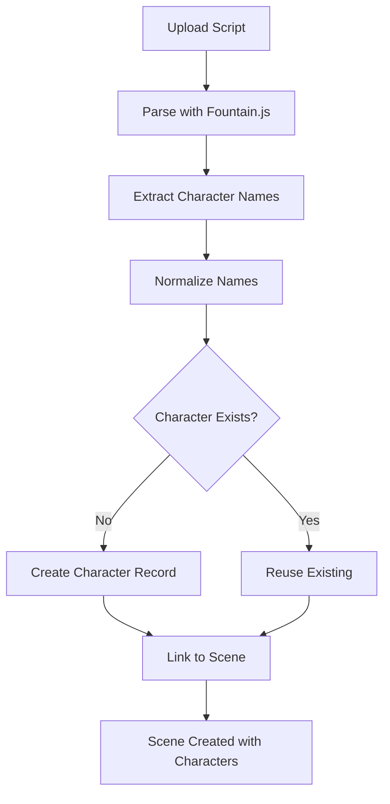

# Character-Cast Member Architecture Implementation

**Version:** 0.2.3  
**Date:** 2026-01-06  
**Type:** Major Feature - Breaking Change  
**Status:** ✅ Complete

## Overview

Complete architectural separation of **Characters** (story roles) from **Cast** (real people), enabling proper casting workflows, understudy management, and script import automation.

---

## 🎯 Problem Statement

### Before (v0.2.2)
The `Cast` table mixed two distinct concepts:
```sql
Cast {
  actor_name TEXT      -- Real person name (e.g., "Tom Hanks")
  character_name TEXT  -- Story role (e.g., "JOHN DOE")
}
```

**Critical Issues:**
- ❌ One Cast Member could only play one character
- ❌ Characters couldn't have understudies or stunt doubles
- ❌ Script imports created "Cast" with no real person info
- ❌ No support for multiple casts (alternate, understudy, etc.)
- ❌ Casting decisions were forced at import time

### After (v0.2.3)
```
Character (story role) ←→ Cast Member (real person)
           ↓
    Many-to-Many via character_cast_assignments
    
Character ←→ Scene (many-to-many via scene_characters)
```

**Benefits:**
- ✅ One character can have multiple Cast (Cast Member, understudy, stunt, voice, etc.)
- ✅ Script import creates characters automatically
- ✅ Cast Member assignment is optional and happens separately
- ✅ Proper casting workflow: Import → Review → Assign Cast
- ✅ Supports complex production scenarios

---

## 📊 Database Architecture

### New Tables

#### `characters`
Story roles extracted from scripts or manually created.

```sql
CREATE TABLE characters (
    id UUID PRIMARY KEY,
    project_id UUID REFERENCES projects(id),
    name TEXT NOT NULL,                    -- Display name (e.g., "JOHN DOE")
    normalized_name TEXT NOT NULL,         -- Deduplication key (e.g., "JOHNDOE")
    role_type TEXT,                        -- 'lead', 'supporting', 'background'
    description TEXT,
    notes TEXT,
    display_order INTEGER,
    
    UNIQUE (project_id, normalized_name)  -- One character per name per project
);
```

**Key Design Decisions:**
- `normalized_name`: UPPERCASE, no punctuation/whitespace → prevents duplicates like "JOHN DOE" vs "John Doe" vs "JOHN (V.O.)"
- Project-scoped: Characters belong to one project
- Orphaned allowed: Characters don't need scenes (pre-production planning)

#### `character_cast_assignments`
Many-to-many linking characters to Cast with assignment types.

```sql
CREATE TABLE character_cast_assignments (
    id UUID PRIMARY KEY,
    character_id UUID REFERENCES characters(id),
    cast_member_id UUID REFERENCES Cast(id),
    assignment_type TEXT DEFAULT 'Cast Member',  -- 'Cast Member', 'understudy', 'stunt_double', etc.
    effective_from DATE,                   -- Optional: scheduling support
    effective_until DATE,
    notes TEXT,
    
    UNIQUE (character_id, cast_member_id, assignment_type)
);
```

**Assignment Types:**
- `Cast Member`: Primary performer
- `understudy`: Backup performer
- `stunt_double`: Stunt scenes
- `photo_double`: Background/distance shots
- `voice`: Voice-over or dubbing
- `alternate`: Alternate cast (e.g., matinee vs evening)

#### `scene_characters`
Which characters appear in which scenes (replaces `scene_cast_members`).

```sql
CREATE TABLE scene_characters (
    id UUID PRIMARY KEY,
    scene_id UUID REFERENCES scenes(id),
    character_id UUID REFERENCES characters(id),
    
    -- Scene-specific metadata
    lines_count INTEGER,
    screen_time_estimate INTEGER,
    
    -- Continuity (references the assigned Cast Member)
    costume_notes TEXT,
    costume_images TEXT[],
    makeup_notes TEXT,
    makeup_images TEXT[],
    
    UNIQUE (scene_id, character_id)
);
```

#### `Cast` (Modified)
Now contains ONLY real person information.

```sql
-- REMOVED: character_name column
-- Cast are now pure "people" records
ALTER TABLE Cast DROP COLUMN character_name;
```

---

## 🔄 Migration Strategy

### Data Transformation

**Step 1:** Create character records from existing Cast
```sql
INSERT INTO characters (project_id, name, normalized_name)
SELECT 
    project_id,
    character_name AS name,
    UPPER(REGEXP_REPLACE(character_name, '[^\w\s]', '', 'g')) AS normalized_name
FROM Cast
WHERE character_name IS NOT NULL;
```

**Step 2:** Create 1:1 Character-Cast Member assignments
```sql
INSERT INTO character_cast_assignments (character_id, cast_member_id, assignment_type)
SELECT c.id, a.id, 'Cast Member'
FROM Cast a
JOIN characters c ON (
    c.project_id = a.project_id 
    AND c.normalized_name = UPPER(REGEXP_REPLACE(a.character_name, '[^\w\s]', '', 'g'))
);
```

**Step 3:** Migrate `scene_cast_members` → `scene_characters`
```sql
INSERT INTO scene_characters (scene_id, character_id, costume_notes, ...)
SELECT sa.scene_id, c.id, sa.costume_notes, ...
FROM scene_cast_members sa
JOIN Cast a ON sa.cast_member_id = a.id
JOIN characters c ON c.normalized_name = UPPER(REGEXP_REPLACE(a.character_name, '[^\w\s]', '', 'g'));
```

**Step 4:** Drop old schema
```sql
ALTER TABLE Cast DROP COLUMN character_name;
DROP TABLE scene_cast_members;
```

---

## 💻 Code Implementation

### CharacterService

New service layer for character CRUD operations.

**Key Methods:**
```javascript
class CharacterService {
    static normalizeCharacterName(name)
    static getAll(projectId)
    static create(projectId, name, options)
    static getOrCreate(projectId, name)  // Idempotent
    static assignActor(characterId, actorId, type)
    static addToScene(sceneId, characterId)
    static getSceneCharacters(sceneId)
    static getUsageCounts(projectId)
}
```

**Normalization Logic:**
```javascript
"JOHN DOE" → "JOHNDOE"
"Mary (V.O.)" → "MARY"
"  Bob  " → "BOB"
```

**File:** `frontend/js/services/characterService.js` (440 lines)

### Script Import Integration

Updated `ScriptImportService` to auto-create characters during import.

**Flow:**
```javascript
1. Parse script → extract character names from dialogue
2. For each unique character:
   - Normalize name
   - Call CharacterService.getOrCreate() → creates if doesn't exist
   - Build character_id map
3. Create scenes
4. Link characters to scenes via scene_characters junction
```

**Key Change:**
```javascript
// Extract unique characters
const uniqueCharacters = [...new Set(
    enabledScenes.flatMap(scene => scene.characters)
)];

// Create character records (idempotent)
for (const characterName of uniqueCharacters) {
    const character = await CharacterService.getOrCreate(projectId, characterName);
    characterMap[characterName] = character.id;
}

// Link to scenes
for (const scene of createdScenes) {
    for (const characterName of scene.characters) {
        await CharacterService.addToScene(scene.id, characterMap[characterName]);
    }
}
```

**File:** `frontend/js/services/scriptImportService.js`

### CharactersConfigModal

New CRUD modal for managing characters and assigning Cast.

**Features:**
- ✅ Search/filter characters
- ✅ Sort by name or usage (scene count)
- ✅ Clean unused characters (batch delete)
- ✅ Inline Cast Member assignment dropdown
- ✅ Usage badges (shows how many scenes)
- ✅ Warning badge if no Cast Member assigned
- ✅ Display all Cast Member assignments (Cast Member, understudy, etc.)

**UI Pattern:**
```
[Search...] [Sort ▼] [Clean Unused]

Characters List:
┌─────────────────────────────────────┐
│ 👤 JOHN DOE           [2 scenes]   │
│    Cast Member: Tom Hanks                 │
│    understudy: Mike Smith           │
├─────────────────────────────────────┤
│ 👤 MARY          [1 scene] ⚠️ No Cast Member │
│    [Assign Cast Member... ▼]              │
└─────────────────────────────────────┘

[+ Add New Character]
```

**File:** `frontend/js/components/charactersConfigModal.js` (480 lines)

**Replaced:** `ActorsConfigModal` (now characters are managed separately)

### Timeline Integration

Scene cards now display characters with Cast Member status.

**Character Badges:**
```html
👥 JOHN DOE  MARY  +2

- Blue badge = has Cast Member assigned
- Gray badge = no Cast Member assigned
- Shows up to 3 characters, then "+X more"
```

**Data Loading:**
```javascript
async function getProjectScenes(projectId) {
    const scenes = await supabase.from('scenes').select('*');
    
    // Load characters for each scene
    for (const scene of scenes) {
        scene.characters = await supabase
            .from('scene_characters')
            .select(`
                *,
                character:characters(
                    *,
                    actor_assignments:character_cast_assignments(
                        *,
                        Cast Member:Cast(*)
                    )
                )
            `)
            .eq('scene_id', scene.id);
    }
    
    return scenes;
}
```

**File:** `frontend/js/timeline.js`

---

## 🎬 Workflows

### Workflow 1: Script Import with Auto-Character Creation



**Example:**
```fountain
INT. COFFEE SHOP - DAY

JOHN
    Hello, Mary!

MARY
    Hi John. How are you?
```

**Result:**
- ✅ 2 characters created: "JOHN", "MARY"
- ✅ Both linked to this scene
- ✅ No Cast assigned yet (optional)

### Workflow 2: Assign Cast to Characters

```
1. User imports script
   → Characters auto-created
   → Shows "⚠️ 5 characters have no Cast Member"

2. User opens Characters Settings
   → Sees list of all characters
   → Characters with no Cast Member show dropdown

3. User assigns Cast:
   - "JOHN" → Tom Hanks (Cast Member)
   - "JOHN" → Mike Smith (understudy)
   - "MARY" → Sarah Johnson (Cast Member)

4. Timeline updates
   → Character badges turn blue (Cast Member assigned)
```

### Workflow 3: Understudy Management

```sql
-- Add main Cast Member
INSERT INTO character_cast_assignments 
VALUES ('char-123', 'Cast Member-456', 'Cast Member');

-- Add understudy
INSERT INTO character_cast_assignments 
VALUES ('char-123', 'Cast Member-789', 'understudy');

-- Add stunt double
INSERT INTO character_cast_assignments 
VALUES ('char-123', 'Cast Member-999', 'stunt_double');
```

**UI Display:**
```
JOHN DOE [5 scenes]
  Cast Member: Tom Hanks
  understudy: Mike Smith
  stunt: James Doe
```

---

## 🧪 Testing Scenarios

### Test Case 1: Duplicate Character Prevention

```javascript
// Create "JOHN DOE"
await CharacterService.create(projectId, "JOHN DOE");

// Try variations (should reuse existing)
await CharacterService.create(projectId, "John Doe");     // → same character
await CharacterService.create(projectId, "JOHN (V.O.)");  // → same character
await CharacterService.create(projectId, "  john  doe"); // → same character
```

**Expected:** Only 1 character record created.

### Test Case 2: Script Import Deduplication

```fountain
JOHN
    Hello!

john
    Goodbye!

JOHN (V.O.)
    Voice over...
```

**Expected:** Only 1 character "JOHN" created, linked to scene 3 times.

### Test Case 3: Multi-Cast Assignment

```javascript
// Main cast
CharacterService.assignActor(charId, actor1, 'Cast Member');

// Alternate cast (e.g., matinee vs evening)
CharacterService.assignActor(charId, actor2, 'alternate');

// Understudy
CharacterService.assignActor(charId, actor3, 'understudy');
```

**Expected:** 3 assignments, all displayed in UI.

---

## 📚 API Reference

### CharacterService Methods

| Method | Parameters | Returns | Description |
|--------|-----------|---------|-------------|
| `normalizeCharacterName()` | `name: string` | `string` | Uppercase, no punctuation |
| `getAll()` | `projectId: UUID` | `Character[]` | All project characters |
| `create()` | `projectId, name, options` | `Character` | Create new character |
| `getOrCreate()` | `projectId, name` | `Character` | Idempotent create |
| `findByNormalizedName()` | `projectId, normalizedName` | `Character \| null` | For deduplication |
| `assignActor()` | `characterId, actorId, type` | `Assignment` | Link Cast Member to character |
| `removeActorAssignment()` | `assignmentId` | `void` | Unlink Cast Member |
| `addToScene()` | `sceneId, characterId` | `SceneCharacter` | Link character to scene |
| `removeFromScene()` | `sceneId, characterId` | `void` | Unlink from scene |
| `getSceneCharacters()` | `sceneId` | `SceneCharacter[]` | All characters in scene |
| `getUsageCounts()` | `projectId` | `Map<UUID, number>` | Scene count per character |

---

## 🔒 Constraints & Validation

### Database Constraints

```sql
-- One character name per project
UNIQUE (project_id, normalized_name)

-- One character per scene (no duplicates)
UNIQUE (scene_id, character_id)

-- One assignment of each type per Character-Cast Member pair
UNIQUE (character_id, cast_member_id, assignment_type)
```

### Business Rules

1. **Character Names:**
   - Must be unique within project (after normalization)
   - Case-insensitive matching
   - Parentheticals stripped: "MARY (V.O.)" = "MARY"

2. **Cast Member Assignment:**
   - Optional at import
   - Multiple Cast per character allowed
   - Same Cast Member-character pair can have multiple types (Cast Member + understudy)

3. **Scene Linking:**
   - Character can appear in 0+ scenes
   - Scene can have 0+ characters
   - Duplicate character in same scene prevented

---

## 🚀 Future Enhancements

### Phase 2: Advanced Casting
- [ ] Casting approval workflow
- [ ] Cast Member availability calendar
- [ ] Conflict detection (Cast Member in 2 scenes on same day)
- [ ] Budget tracking per Cast Member

### Phase 3: Production Management
- [ ] Call sheets with character/Cast Member mapping
- [ ] Costume/makeup tracking per assignment
- [ ] Photo reference library per Character-Cast Member pair

### Phase 4: Analytics
- [ ] Screen time per character
- [ ] Cast Member workload reports
- [ ] Character appearance frequency
- [ ] Co-appearance matrix (which characters share scenes)

---

## 📝 Migration Notes

### Breaking Changes

1. **Database Schema:**
   - `Cast.character_name` column removed
   - `scene_cast_members` table dropped, replaced by `scene_characters`

2. **API Changes:**
   - ActorsConfigModal → CharactersConfigModal
   - Scene data now includes `characters` array (not `Cast`)

### Backward Compatibility

- ❌ No automatic rollback possible (data transformation is irreversible)
- ✅ Migration preserves all existing data relationships
- ✅ Existing Cast become characters with 1:1 Cast Member assignments

### Deployment Checklist

- [x] Database migration script created
- [x] CharacterService implemented
- [x] ScriptImportService updated
- [x] CharactersConfigModal created
- [x] Timeline character display implemented
- [x] Documentation complete
- [ ] Run migration on production database
- [ ] Verify all existing data migrated correctly
- [ ] Test script import with new architecture

---

## 📊 Metrics

**Code Changes:**
- New files: 4
  - `supabase/migrations/20260106000001_add_characters_architecture.sql` (350 lines)
  - `frontend/js/services/characterService.js` (440 lines)
  - `frontend/js/components/charactersConfigModal.js` (480 lines)
  - `docs/releases/v0.2.3/CHARACTER_ACTOR_ARCHITECTURE.md` (this file)

- Modified files: 4
  - `frontend/js/services/scriptImportService.js` (+40 lines)
  - `frontend/js/timeline.js` (+45 lines)
  - `frontend/js/components/sceneCardRenderer.js` (+25 lines)

**Database Changes:**
- New tables: 3 (`characters`, `character_cast_assignments`, `scene_characters`)
- Modified tables: 1 (`Cast` - removed `character_name`)
- Dropped tables: 1 (`scene_cast_members`)

**Total LOC:** ~1,380 lines (code + SQL + docs)

---

## ✅ Completion Checklist

- [x] Database schema designed
- [x] Migration script created with data transformation
- [x] CharacterService implemented with all CRUD methods
- [x] ScriptImportService updated for auto-character creation
- [x] CharactersConfigModal with Cast Member assignment UI
- [x] Timeline character display with badges
- [x] Scene card renderer updated
- [x] Character normalization and deduplication
- [x] Usage count tracking (scenes per character)
- [x] "Clean unused" batch operation
- [x] Search and sort functionality
- [x] Documentation complete
- [x] All design questions answered and resolved

---

**Status:** ✅ **COMPLETE** - Ready for testing and deployment

**Next Steps:**
1. Run migration on development database
2. Test full workflow (import → assign → display)
3. Deploy to production
4. Monitor for any migration issues
